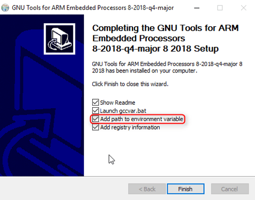
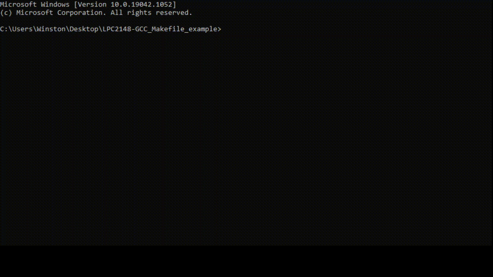

# Programming LPC2148 with GNU Arm Embedded Toolchain, Makefile and `lpc21isp`
- This is a template project to show how LPC2148 can be programmed with GCC and Makefile
- Edit `project.mk` to add more files to the project, configure build or upload options
---
## Windows
- Download and install [GNU ARM Tools for Windows 32-bit](https://developer.arm.com/tools-and-software/open-source-software/developer-tools/gnu-toolchain/gnu-rm/downloads)
- Make sure you add to environmental variable `PATH` at end of installation



- Run `make PORT=COMx upload` to compile and upload the program.



## Linux

### Debian based Linux distros (Eg: Ubuntu)
- Install GNU Arm Embedded, GNU Make and LPC21xx ISP Flash tool
```bash
$ sudo apt install gcc-arm-none-eabi make lpc21isp
```
- Run `make PORT=/dev/ttyUSBx upload` to compile and upload the program. Replace `x` by COM port number.

---
## Note
- `lpc21isp` was compiled for Windows from source code available at https://github.com/capiman/lpc21isp
   - Download [source code snapshot](https://github.com/capiman/lpc21isp/archive/cf89d0b122ef02358e0f130b8f32cb804c11a54e.zip)
   - GPL license applies !
---